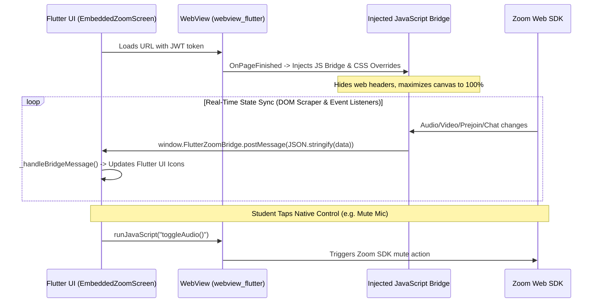

# Zoom Bridge & Hybrid WebView Architecture

This document details the design and implementation of the live virtual classroom inside `lms-mobile` located at [`lib/screens/live/embedded_zoom_screen.dart`](file:///c:/Users/user/Desktop/Downloads/premier_lms_mobile/lms-mobile/lib/screens/live/embedded_zoom_screen.dart).

---

## 💡 The Hybrid Architecture Decision

Rather than bundling heavy native Zoom SDK binaries (which introduce large binary bloat, complex native build configurations, and frequent SDK deprecations), the app employs a **Hybrid Web-to-Native Bridge**:

1. The Flutter app embeds a high-performance `WebViewWidget` pointed at the Next.js meeting route:
   `https://www.premiertaxschool.com/dashboard/classes/[id]?fromApp=true&token=[jwt]`
2. The web page renders the official `@zoom/meetingsdk` inside the WebView.
3. The Flutter application injects a robust JavaScript bridge that communicates bidirectionally with Flutter via `JavaScriptChannel('FlutterZoomBridge')`.
4. Native Flutter UI overlays provide the student with intuitive mobile controls (microphone, camera, speaker, hand-raise, and chat modal).

---

## 🔄 Bidirectional Communication Lifecycle

---

## 🧩 Injected Bridge Capabilities

The bridge in `embedded_zoom_screen.dart` injects comprehensive client-side scripts:

1. **DOM Cleaning & Layout Optimization:**
   * Removes all Next.js web navigation elements, breadcrumbs, footers, and redundant web toolbars.
   * Maximizes the Zoom `#zmmtg-root` canvas to fill 100% of the viewport width and height.

2. **Hardware State Polling:**
   * Detects whether the student's microphone is actively muted or unmuted.
   * Detects camera status and active speaker status.
   * Posts state back to Flutter: `{ type: 'audioState', isMuted: true }`.

3. **Live Chat Extraction (DOM Mutation Listener):**
   * Observes the Zoom chat container for new chat messages.
   * Parses sender name and message content, deduplicating them and sending them to Flutter's native bottom-sheet chat viewer:
     `{ type: 'chatMessage', sender: 'Instructor', message: 'Welcome to Lecture 3' }`.
   * When the student sends a message from Flutter, `_sendChatMessage()` injects the message directly into the Zoom chat input box and clicks send.

4. **Orientation & Edge-to-Edge Fullscreen:**
   * Supports both landscape and portrait orientations seamlessly.
   * In landscape mode, floating controls auto-hide after 3 seconds of inactivity to provide an uninterrupted view of the shared lecture slides.
